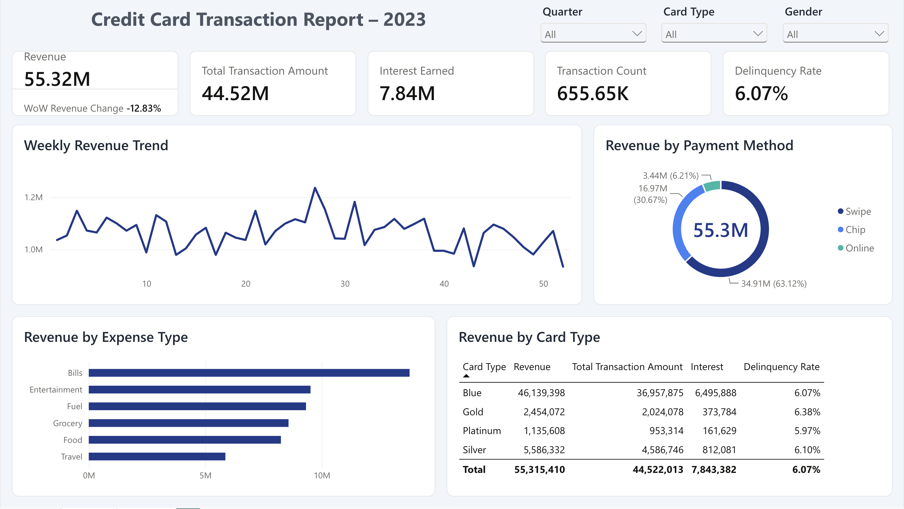
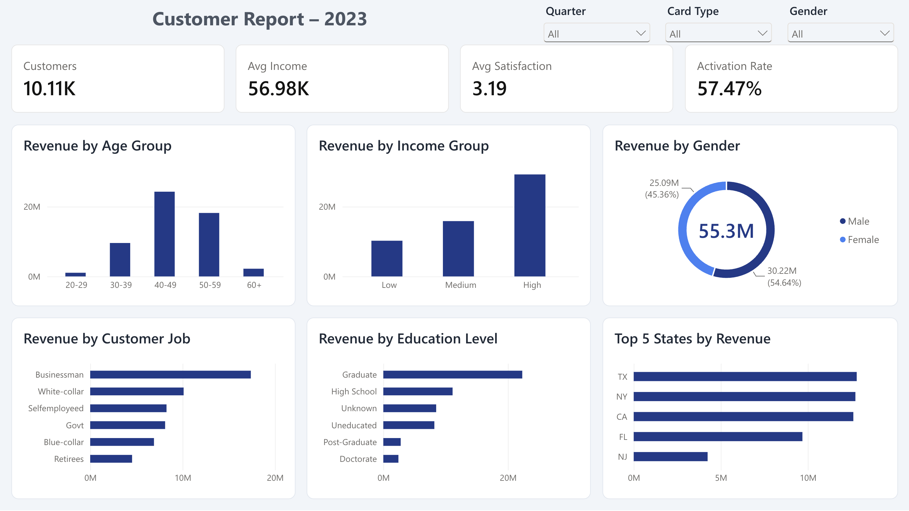

# Credit Card Financial Dashboard — Power BI

An interactive two-page Power BI report analysing 2023 credit card revenue, transactions, risk and customer segments for ~10,000 customers. It was built entirely in the **Power BI service (browser)**, using Power Query Online for data preparation and DAX for the measures.




---

## Business questions
1. How much revenue does the card business generate, and where does it come from (fees, transactions, interest)?
2. Which card types, payment methods and spending categories drive revenue?
3. How is revenue trending week over week?
4. Which customer segments (age, income, job, education, gender, state) are most valuable?
5. Is delinquency risk concentrated in any card type?

## Dataset
- **Source:** [Credit Card Financial Dashboard dataset — Kaggle](https://www.kaggle.com/datasets/nibeditasahu/credit-card-financial-dashboard-using-power-bi)
- **Tables:** `credit_card` (10,108 rows, 18 columns) and `customer` (10,108 rows, 15 columns), joined on `Client_Num`
- **Period:** weekly records, 1 Jan – 24 Dec 2023
- **License:** MIT, as listed on the Kaggle dataset page. The raw CSVs in `data/` are redistributed under that license with credit to the original dataset.

## Tools
Power BI service (web) · Power Query Online · DAX · Data modelling

## Data preparation (Power Query Online)
| Issue found | Fix |
|---|---|
| Dates stored as `DD-MM-YYYY` text | Converted to Date using the *English (UK)* locale |
| Trailing spaces in payment method (`"Swipe "`) | Trim |
| Week stored as text (`Week-1`) and sorting wrong | Extracted numeric `Week_No` |
| Unclear column names (`Use Chip`, `Exp Type`) | Renamed to `Payment_Method`, `Expense_Type` |
| Gender coded `F` / `M` | Replaced with `Female` / `Male` |
| No segment groupings | Added `Age_Group` and `Income_Group` conditional columns |

## Data model
One-to-one relationship between `customer` and `credit_card` on `Client_Num`, with bi-directional filtering so slicers from either table filter every visual.

## Key DAX measures
```DAX
Revenue = SUMX(credit_card, credit_card[Annual_Fees] + credit_card[Total_Trans_Amt] + credit_card[Interest_Earned])

Delinquency Rate = DIVIDE([Delinquent Accounts], COUNTROWS(credit_card))

Current Week Revenue =
VAR LatestWeek = CALCULATE(MAX(credit_card[Week_No]), ALLSELECTED(credit_card))
RETURN CALCULATE([Revenue], credit_card[Week_No] = LatestWeek)

Previous Week Revenue =
VAR LatestWeek = CALCULATE(MAX(credit_card[Week_No]), ALLSELECTED(credit_card))
RETURN CALCULATE([Revenue], credit_card[Week_No] = LatestWeek - 1)

WoW Revenue Change = DIVIDE([Current Week Revenue] - [Previous Week Revenue], [Previous Week Revenue])
```
Other measures: Total Transaction Amount, Transaction Count, Interest Earned, Annual Fees, Activation Rate, Avg Utilization, Acquisition Cost, Customers, Avg Income, Avg Satisfaction.

## Headline numbers
| KPI | Value |
|---|---|
| Revenue | 55.32M |
| Total transaction amount | 44.52M |
| Interest earned | 7.84M |
| Transactions | 655,651 |
| Delinquency rate | 6.07% |
| Customers | 10,108 |
| 30-day activation rate | 57.5% |

## Key insights
- **Blue cards drive the business:** 83% of revenue (46.1M of 55.3M). Gold and Platinum together contribute only 6.5%.
- **Swipe dominates payments (63%)**, while online is just 6%. That leaves room to grow digital and online usage.
- **Bills are the largest spend category** (25% of revenue), followed by Entertainment and Fuel.
- **Delinquency is flat across card tiers (6.0–6.4%).** Card type is not a useful risk signal on its own.
- **High-income customers are 29% of the base but generate 53% of revenue.**
- **Ages 40–49 are the core segment**, at 44% of revenue.
- **Men generate 55% of revenue while making up 42% of customers.**
- **Data-quality note:** the −12.8% week-over-week drop in the final week is an artefact, not a real decline. Week 52 holds fewer records (164 vs 195) because the data ends on 24 December.

## Report pages
1. **Overview:** KPI cards with WoW change, weekly revenue trend, revenue by payment method, expense type and card type.
2. **Customers:** customer KPIs and revenue by age group, income group, gender, job, education and top 5 states.

All visuals respond to the Quarter, Card Type and Gender slicers.

## Author

**Tahir Suleymanov**  
Data Scientist  
[LinkedIn](https://www.linkedin.com/in/tahirsuleymanov/)
